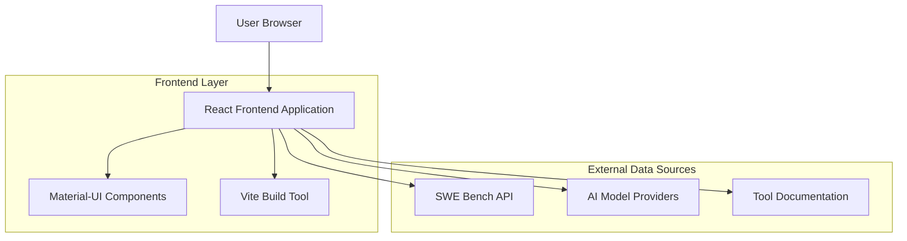

## 1. Architecture design



## 2. Technology Description
- Frontend: React@18 + Material-UI@5 + Vite
- Initialization Tool: vite-init
- Backend: None (static site with external API calls)
- Key Dependencies:
  - @mui/material@5 (Material Design components)
  - @mui/icons-material (Material icons)
  - framer-motion (animations)
  - axios (HTTP requests)
  - react-router-dom@6 (routing)

## 3. Route definitions
| Route | Purpose |
|-------|---------|
| / | Home page with hero section and navigation |
| /internal | Internal AI resources page with platform sections |
| /external | External AI resources page with four charts |

## 4. Component Architecture
### 4.1 Core Components
- **Header**: Navigation component with Material App Bar
- **HeroSection**: Animated landing section with call-to-action
- **InternalResources**: Container for AI platform and tooling table
- **ExternalResources**: Container for four AI resource charts
- **AIPatformCard**: Reusable card for Model Garden, Rag Studio, Wiki
- **ToolingTable**: Material Data Table with search and sort
- **ResourceChart**: Reusable chart component for external resources

### 4.2 State Management
- React Context API for global state (selected resources, filters)
- useState hooks for local component state
- useEffect hooks for API data fetching

### 4.3 Data Flow
1. Component mounts → useEffect triggers API calls
2. External APIs (SWE Bench, model providers) return data
3. Data processed and stored in component state
4. Material-UI components render based on state
5. User interactions update state and re-render

## 5. Performance Optimization
- **Code splitting**: React.lazy() for route-based splitting
- **Image optimization**: WebP format with lazy loading
- **Bundle optimization**: Vite's built-in tree shaking
- **Caching**: Browser caching for static assets
- **Animation optimization**: GPU-accelerated transforms

## 6. External API Integration
### 6.1 SWE Bench API
- Endpoint: GET https://www.swebench.com/api/models
- Purpose: Fetch latest AI model benchmarking data
- Response format: JSON with model rankings and scores

### 6.2 AI Model Providers
- Hugging Face API for model listings
- Open Router API for available models
- GitHub API for trending AI tools

### 6.3 Error Handling
- Axios interceptors for global error handling
- Fallback data for failed API calls
- User-friendly error messages with Material-UI Snackbar

## 7. Development Setup
```bash
# Project initialization
npm create vite@latest abc-ai-community --template react

# Install dependencies
npm install @mui/material @emotion/react @emotion/styled @mui/icons-material
npm install framer-motion axios react-router-dom

# Development server
npm run dev
```

## 8. Build and Deployment
- **Build**: Vite production build with optimization
- **Static hosting**: Netlify, Vercel, or GitHub Pages
- **CDN**: Cloudflare for global asset distribution
- **Domain**: Custom domain with SSL certificate