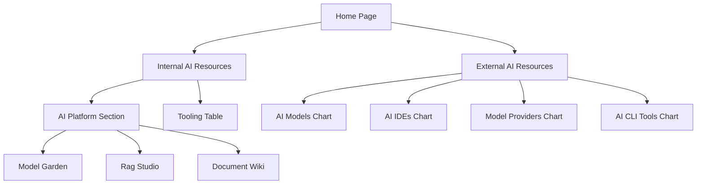

## 1. Product Overview
ABC AI Community is a modern landing page designed to empower and encourage anyone interested in AI tooling resources and knowledge. The platform serves as a centralized hub displaying both internal organizational AI resources and external cutting-edge AI tools and models.

The product targets AI enthusiasts, developers, and organizational members seeking comprehensive AI resource discovery and access to both proprietary and public AI tooling.

## 2. Core Features

### 2.1 User Roles
This is a public-facing informational website with no user authentication required. All visitors have equal access to browse and explore AI resources.

### 2.2 Feature Module
The ABC AI Community landing page consists of the following main pages:
1. **Home page**: hero section, header navigation, modern visual design with animations
2. **Internal AI Resources page**: AI platform section (Model Garden, Rag Studio, Document Wiki), tooling table with wiki links
3. **External AI Resources page**: four top charts (AI Models, AI IDEs, Model Providers, AI CLI Tools)

### 2.3 Page Details
| Page Name | Module Name | Feature description |
|-----------|-------------|---------------------|
| Home page | Hero section | Display modern hero banner with animated elements, showcase ABC AI Community branding |
| Home page | Header navigation | Two main navigation buttons: Internal AI Resources and External AI Resources |
| Internal AI Resources | AI Platform section | Large prominent section containing Model Garden (AI models showcase), Rag Studio (RAG implementation area), Document Wiki (knowledge base) |
| Internal AI Resources | Tooling table | Comprehensive table listing available internal tools (Pomped Book, MCP Hub, etc.) with wiki links and web page access |
| External AI Resources | AI Models chart | Top chart displaying latest best AI models worldwide with SWE Bench benchmarking data |
| External AI Resources | AI IDEs chart | Top 10 AI-powered IDEs (Cursor, Trae, VS Code with Copilot) |
| External AI Resources | Model Providers chart | External model providers (Open Router, Hugging Face, etc.) for funding/buying AI models |
| External AI Resources | AI CLI Tools chart | Popular command-line AI tools (Cloud Code, Open Code, etc.) |

## 3. Core Process
Users arrive at the modern home page with animated hero section. From the header navigation, they can choose to explore either Internal AI Resources or External AI Resources. The Internal page showcases the organization's AI platform with Model Garden, Rag Studio, and Document Wiki, followed by a detailed tooling table. The External page presents four comprehensive charts covering the best AI models, IDEs, providers, and CLI tools available globally.

## 4. User Interface Design

### 4.1 Design Style
- **Primary colors**: Deep blue (#1976D2) and white, following Google Material Design principles
- **Secondary colors**: Light gray (#F5F5F5) and accent orange (#FF9800) for highlights
- **Button style**: Material Design raised buttons with ripple effects and rounded corners
- **Font**: Roboto family with hierarchy: H1 32px, H2 24px, body 16px, small 14px
- **Layout style**: Card-based layout with elevation shadows, top navigation header
- **Icons**: Material Design icons with consistent line weight and color
- **Animations**: Smooth transitions, fade-ins, hover effects, and parallax scrolling

### 4.2 Page Design Overview
| Page Name | Module Name | UI Elements |
|-----------|-------------|-------------|
| Home page | Hero section | Full-width animated banner with gradient overlay, floating AI-themed icons, animated text reveal, call-to-action buttons |
| Home page | Header navigation | Sticky Material App Bar with logo, two prominent navigation buttons with hover animations, responsive hamburger menu |
| Internal AI Resources | AI Platform section | Large card grid layout with elevation shadows, each platform component (Model Garden, Rag Studio, Wiki) as interactive cards with icons |
| Internal AI Resources | Tooling table | Material Data Table with sortable columns, search functionality, wiki link buttons, status indicators |
| External AI Resources | Charts section | Four-column responsive grid, each chart as Material card with ranking numbers, tool logos, brief descriptions, external link buttons |

### 4.3 Responsiveness
Desktop-first design approach with mobile adaptation. The layout scales gracefully from desktop (1200px+) to tablet (768px) to mobile (320px). Touch interactions are optimized for mobile devices with larger tap targets and swipe gestures for navigation.

### 4.4 Animation Guidelines
- Page transitions: Fade-in with 300ms ease-in-out
- Card hover: Scale(1.05) with 200ms transition
- Button interactions: Ripple effect from click point
- Hero text: Typewriter effect with staggered timing
- Chart loading: Skeleton screens with shimmer effect